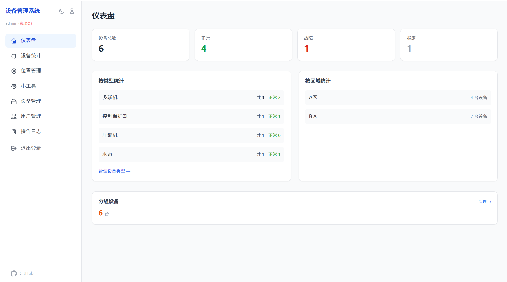
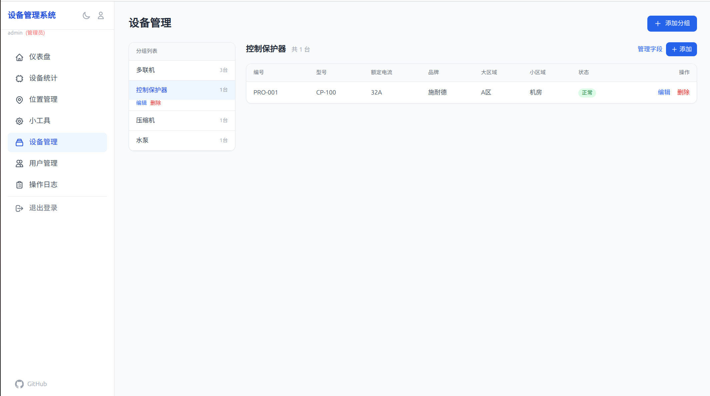
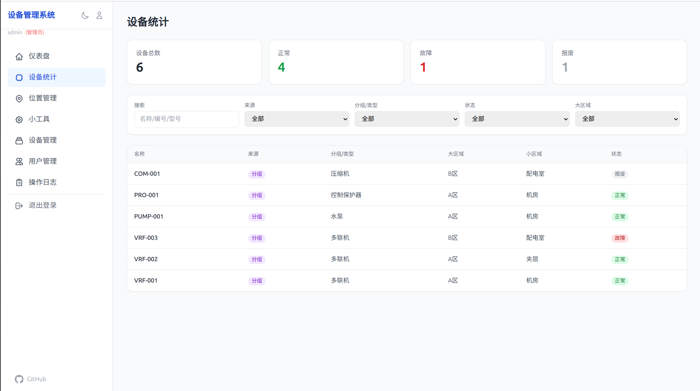

# 设备管理系统

小团队设备管理 Web 应用，支持分组设备管理、自定义字段、位置层级、辅助计算工具。

## 功能

- **仪表盘** — 设备总数/状态统计/类型分布/区域分布/分组设备统计
- **设备统计** — 统一/跨类型设备查询与筛选
- **设备管理** — 按分组（多联机/控制保护器/压缩机/水泵）管理设备，每组独立字段模板
- **位置管理** — 大区域 → 小区域层级结构
- **小工具** — 能耗估算（选设备+开停机时间）、压力单位换算、欧姆定律计算

## 技术栈

- Python 3 / FastAPI / SQLAlchemy / SQLite
- Jinja2 / Tailwind CSS (CDN) / Alpine.js

## 安装

默认账户 `admin` / `admin123`，**启动前必须设置 `SECRET_KEY` 环境变量**。

### 方式一：Docker 运行（推荐）

```bash
docker run -d --name device-mgr \
  -p 8080:8080 \
  -e SECRET_KEY="$(openssl rand -hex 32)" \
  -v "$(pwd)/data:/app/data" \
  mibusix/device-management:latest
```

浏览器打开 `http://localhost:8080`。

### 方式二：Docker Compose

```bash
git clone https://github.com/mibusix/Device-Management.git
cd Device-Management
echo "SECRET_KEY=$(openssl rand -hex 32)" > .env
docker compose up -d
```

### 方式三：直接安装

```bash
git clone https://github.com/mibusix/Device-Management.git
cd Device-Management
pip install -r requirements.txt
export SECRET_KEY="$(openssl rand -hex 32)"
uvicorn app.main:app --host 0.0.0.0 --port 8080
```

## 项目结构

```
├── app/
│   ├── main.py              # 入口 + Cookie JWT 认证中间件
│   ├── config.py            # 配置
│   ├── database.py          # SQLite 连接 + 预设分组种子 + 自动迁移
│   ├── models.py            # 数据模型（User/OperationLog + 设备模型）
│   ├── auth.py              # JWT 认证、密码哈希、权限控制
│   ├── routers/
│   │   ├── pages.py         # 页面路由
│   │   ├── devices.py       # 系统设备 API
│   │   ├── locations.py     # 位置 API
│   │   ├── groups.py        # 分组管理 API
│   │   ├── stats.py         # 统一设备统计 API
│   │   ├── auth.py          # 登录/登出 API
│   │   ├── users.py         # 用户管理 API（管理员）
│   │   └── logs.py          # 操作日志 API
│   └── templates/
│       ├── base.html        # 布局（响应式导航 + 用户菜单）
│       ├── login.html       # 登录页
│       ├── dashboard.html
│       ├── devices/
│       ├── groups/
│       ├── locations/
│       ├── tools/           # 小工具（能耗/压力/电学计算）
│       ├── users/           # 用户管理
│       └── logs/            # 操作日志
├── data/
│   └── devices.db           # SQLite 数据库（自动创建）
├── Dockerfile
├── docker-compose.yml
├── requirements.txt
└── README.md
```

## 用户系统

内置三级角色用户管理，所有操作均有日志记录：

| 角色 | 查看 | 创建/修改/删除 | 用户管理 | 日志查看 |
|------|:----:|:----------:|:------:|:------:|
| 管理员 (admin) | ✅ | ✅ | ✅ | ✅ |
| 普通用户 (user) | ✅ | ✅ | ❌ | ✅ |
| 访客 (guest) | ✅ | ❌ | ❌ | ❌ |

首次启动自动创建 `admin/admin123` 管理员账户，登录后可在「用户管理」中创建其他用户。

## 使用流程

1. **登录** → 访问 `/login`，默认管理员 `admin` / `admin123`
2. **位置管理** → 添加大区域（A区/B区），再添加小区域（机房/夹层）
3. **设备管理** → 分组会预设 4 类（多联机/控制保护器/压缩机/水泵），进入分组 → 管理字段模板 → 添加设备
4. **设备统计** → 统一查看所有系统设备
5. **小工具** → 能耗估算、压力换算、电阻/电流/电压计算
6. **用户管理**（管理员） → 创建/编辑/禁用用户
7. **操作日志** → 查看所有增删改操作记录

## 截图

<p align="center">
  
  
</p>
<p align="center">
  
</p>

---

## 环境变量

| 变量名 | 必填 | 默认值 | 说明 |
|--------|------|--------|------|
| `SECRET_KEY` | 是 | 无 | JWT 签名密钥，启动前必须设置 |
| `DATABASE_URL` | 否 | `sqlite:///data/devices.db` | 数据库连接字符串 |
| `HTTPS` | 否 | 空 | 设为 `1` 时 Cookie 启用 `secure` 标志 |

**.env 示例：**
```env
SECRET_KEY=your_random_secret_key_here
DATABASE_URL=sqlite:///data/devices.db
HTTPS=1
```

## 验证部署

```bash
# 登录获取 token
curl -c /tmp/cookies.txt -X POST http://localhost:8080/api/auth/login \
  -H "Content-Type: application/json" \
  -d '{"username":"admin","password":"admin123"}'

# 测试统计 API
curl -b /tmp/cookies.txt http://localhost:8080/api/stats/devices

# 未登录返回 401
curl -i http://localhost:8080/api/devices/
```

## FAQ

**Q: 启动报错 "Address already in use"？**
- 端口被占，换端口：`uvicorn app.main:app --port 9000`（直接安装）或修改 `-p` 参数（Docker）

**Q: 忘记管理员密码？**
- 删除 `data/devices.db`，重启服务自动恢复 `admin` / `admin123`

**Q: 如何重置数据库？**
- Docker：删除本地 `data/` 目录，重启容器
- 直接安装：删除 `data/devices.db`，重启服务

**Q: 如何备份数据？**
- SQLite 是单文件，直接备份 `data/devices.db` 即可

**Q: 如何启用 HTTPS？**
- 推荐使用 Nginx 或 Caddy 作为反向代理，设置 `HTTPS=1` 启用 secure cookie
